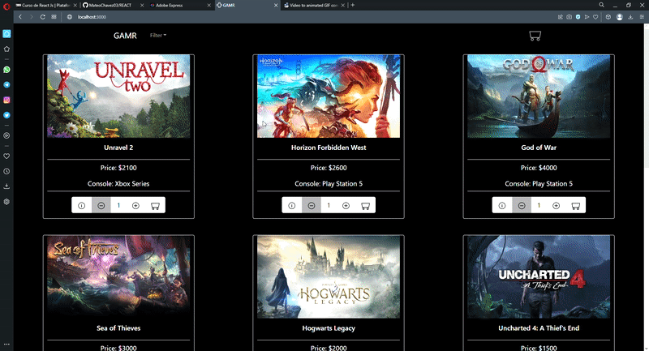

# **GAMR** 

___

## PROYECTO FINAL REACT JAVASCRIPT - PRIMER PRE-ENTREGA 📝

___

### COMANDOS DE INSTALACIÓN E INICIALIZACIÓN 🚩

1. **npm install** (instala las dependencias necesarias para que el proyecto funcione).
2. **npm start** (inicializa el proyecto mediante un host local).

___

### INFORMACIÓN DEL PROYECTO ❔

##### **Simulación de e-commerce de videojuegos**
**En el presente proyecto se presenta un e-commerce que brinda información sobre videojuegos pertenecientes a Play Station 5 y Xbox Series, y además es posible adquirir copias digitales de los mismos.**  

**El proyecto presenta las siguientes funcionalidades:**
* Método de filtrado por categoría a partir de la consola a la cual pertenece cada videojuego.
* Método para acceder al detalle de los productos a partir del ID de cada videojuego.
* Método para agregar más de una copia de cada videojuego, dependiendo del stock disponible.
* Método para generar orden de compra.

**Navegación principal de la página:**  

___

### DEPENDENCIAS 💡

* **REACT-BOOTSTRAP** (versión 2.4.0) y **BOOTSTRAP** (versión 5.1.3)  
*Utilicé este framework por que me permite tomar componentes pre-establecidos y modificarlos a partir del uso de clases de Bootstrap.* 
* **SWEET ALERT 2** (versión 11.4.18) 🍩
*Decidí implementar las alertas de Sweet Alert ya que, en comparación con React-Bootstrap, son de fácil implementación y me permite estilizarlas de manera más sencilla.*
* **ANIMATE.CSS** (versión 4.1.1)
*Era necesario implementarlo para que las animaciones de las alertas se ejecuten correctamente.*
* **REACT-ICONS** (versión 4.4.0)  
*Implementé React Icons ya que provee una gran cantidad de iconos de diversas librerías, entre ellos los de Bootstrap e Ionicons, presentes en el proyecto.*
* **FIREBASE**  
*Utilizado como base de datos para almacenar productos y órdenes de compra.*

___

### AUTOR 🧠

#### Mateo Chavez
